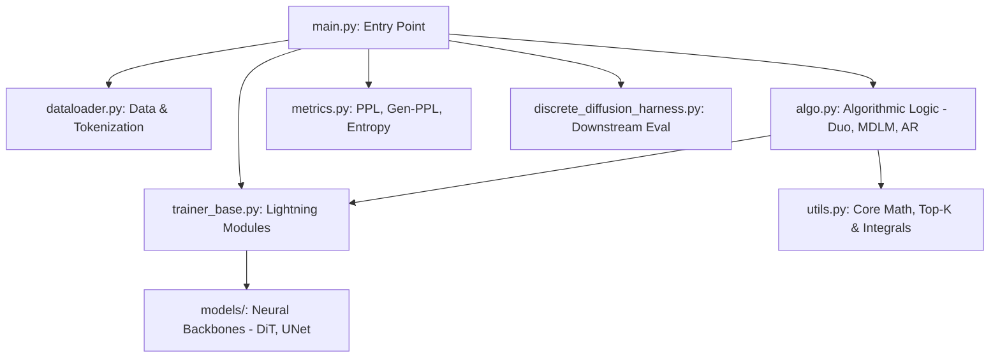

# The Diffusion Duality: Duo Codebase Walkthrough & Explanation

This document provides a comprehensive explanation of the **Duo** repository, which implements **The Diffusion Duality** (Chapter I: ICML 2025 and Chapter II: ICLR 2026). It details the codebase architecture, its mathematical foundation, how components interact, and how various discrete diffusion and autoregressive baselines are structured.

---

## 1. Executive Summary & Core Concepts

Traditional discrete diffusion models (such as MDLM or SEDD) operate on discrete states using either **Absorbing-State** masking (replacing tokens with a `[MASK]` token) or **Uniform-State** transitions (replacing tokens with random uniform noise). 

**Duo** introduces a mathematical **duality** between continuous **Gaussian diffusion** and discrete **Uniform-State Diffusion Models (USDM)**. 

### Why is this duality important?
1. **Few-step Generation**: Continuous-space Gaussian diffusion has well-developed sampling acceleration theories (e.g., probability flow, Predictor-Corrector, and distillation). By mapping Gaussian diffusion paths directly onto discrete uniform-state spaces, Duo unlocks few-step generation for discrete models.
2. **Continuous-to-Discrete Mapping**: Duo trains a model in continuous/Gaussian space but computes the discrete-space ELBO (Evidence Lower Bound) loss, ensuring the model is optimized for discrete text or image generation.
3. **$\text{Duo}^\text{++}$ (Fast Curriculum)**: The original Duo required slow numerical integration or large series expansions to compute the transition coefficients. $\text{Duo}^\text{++}$ replaces this with fast, fitted polynomial approximations (like `poly9`) and a **Tempered Softmax Top-K** sparse approximation, accelerating training and enabling scaling to large vocabularies.

---

## 2. High-Level Architecture & File Map

The repository is structured as a modular PyTorch / PyTorch Lightning codebase:



### Core Files
* **main.py**: The central runner. It coordinates Hydra configurations, seeds, model initialization, and launches training, validation, perplexity evaluation, or image FID evaluation.
* **algo.py**: Defines the mathematical loss and forward process for different algorithms: `AR`, `MDLM`, `DUO_BASE`, `DUO`, `D3PMAbsorb`, `SEDDAbsorb`, and `Distillation`.
* **trainer_base.py**: Contains the base PyTorch Lightning classes. It manages the training/validation steps, exponential moving averages (EMA), and implements the core reverse-process samplers (ancestral, Predictor-Corrector/$\Psi$-samplers, and analytic).
* **models/dit.py**: Implements the **Diffusion Transformer (DiT)** architecture, supporting causal/non-causal attention, AdaLN (Adaptive LayerNorm) modulation, Rotary Positional Embeddings, and the custom sparse embedding bag layer.
* **utils.py**: House of the mathematical mechanics: pre-computing integrals, series coefficients, polynomial/sigmoid curve-fitting, Floyd's top-k sampler, and the tempered softmax top-k math.
* **dataloader.py**: Tokenizers and dataset handlers for `Wikitext`, `PTB`, `OpenWebText`, `Lambada`, and `CIFAR-10` (representing pixel-level discrete tokens). Includes sentence packing.
* **metrics.py**: Evaluates sample quality. It computes generative perplexity (Gen-PPL) by loading a Hugging Face causal LM (e.g. `gpt2-large`) and calculating cross-entropy on generated sentences.

---

## 3. Mathematical Foundations of Duo

To understand how the code works, we must detail the transition from continuous noise to discrete states.

### 3.1 The Duality Mapping
Let $x_0 \in \{0, 1\}^V$ be a one-hot representation of a token. In continuous Gaussian diffusion, we define a noisy state:
$$x_t \sim \mathcal{N}(\alpha_t^{\text{Gauss}} x_0, (\sigma_t^{\text{Gauss}})^2 I)$$
Using a sigmoid schedule, we write this in terms of the log-SNR parameter $\gamma_t$:
$$\alpha_t^{\text{Gauss}} = \sqrt{\sigma(-\gamma_t)}, \quad \sigma_t^{\text{Gauss}} = \sqrt{\sigma(\gamma_t)}$$

Under Uniform-State Diffusion (USDM), at time $t$, a token is either preserved with probability $\alpha_t^{\text{USDM}}$ or replaced by a random token from the uniform distribution with probability $1 - \alpha_t^{\text{USDM}}$. 

The **Duality Theorem** mapping connects the continuous log-SNR $\gamma_t$ to the USDM discrete state probability $\alpha_t^{\text{USDM}}$:
$$\alpha_t^{\text{USDM}} = g(\gamma_t) = \frac{V}{V - 1} \left( \mathbb{E}_{X \sim \mathcal{N}\left(\exp(-\gamma_t/2), 1\right)} [\Phi(X)^{V-1}] - \frac{1}{V} \right)$$
where $\Phi$ is the standard normal CDF, and $V$ is the vocabulary size.

### 3.2 Solving the Integration Overhead
The integral $g(\gamma_t)$ has no analytical closed-form solution. The codebase implements three approaches to compute $\alpha_t$ and its derivative $\text{d}\alpha_t$ (in `utils.py` and `algo.py`):
1. **Numerical Integration Cache (`simple`/`efficient_cached`)**: 
   Uses Scipy's `quad` function to precompute the integral and its gradient across a grid. These are saved in `integral/*.pkl` (e.g., `gpt2.pkl` or `bert-base-uncased.pkl`) and loaded into PyTorch tensors for interpolation during training.
2. **Series Expansion (`series`)**: 
   Computes Taylor-like series coefficients using Gauss-Hermite quadrature and sums the series dynamically.
3. **Polynomial Approximations (`poly9`, `sigmoid-edge-corrected`)**:
   Fits a polynomial or modified sigmoid to the pre-computed curve using Scipy's `curve_fit`. This is fast, JIT-compilable with `torch.compile`, and requires zero filesystem lookup during training, making it the default choice in $\text{Duo}^\text{++}$.

---

## 4. Key Engineering Implementations

### 4.1 Tempered Softmax Top-K Sparse Approximation
If the vocabulary $V$ is large (e.g., 50,257 for GPT-2), generating a full dense continuous tensor $x_t \in \mathbb{R}^{B \times L \times V}$ is computationally prohibitive. Duo solves this by performing a sparse top-$K$ approximation (`sample_tempered_softmax_topk` in `utils.py`):

1. It samples the top $K$ order statistics of $V-1$ zero-mean Gaussians, and a single Gaussian representing the true token $x_0$ with mean $\alpha$.
2. It approximates the tail (all remaining $V-K$ tokens) using a truncated normal expectation.
3. It performs a softmax over the top-$K$, the tail, and the true token.
4. The output is a sparse set of indices and their corresponding softmax weights.

#### The Sparse Embedding Bag
In `models/dit.py`, the `EmbeddingLayer` uses `F.embedding_bag` to aggregate these sparse representations efficiently:
```python
class EmbeddingLayer(nn.Module):
  # ...
  def forward(self, x, weights=None):
    if weights is not None:
      bs, seq_len, k = x.shape
      flat_x = x.reshape(-1, k)
      flat_w = weights.reshape(-1, k).float()
      bag = F.embedding_bag(flat_x, self.embedding.float(),
                            per_sample_weights=flat_w,
                            mode='sum')
      return bag.view(bs, seq_len, -1)
    # ...
```
This bypasses dense matrix multiplications of size $V$, resulting in a massive speedup during training.

---

## 5. Walkthrough of the Reverse-Process Samplers

The codebase supports multiple sampler types inside `trainer_base.py` (`generate_samples` method):

### 5.1 Ancestral Sampler
Uses the standard discrete posterior transition:
$$q(z_s \mid z_t, x_{\theta})$$
At each step, the model predicts the clean probability distribution $x_{\theta}$, and samples the next step $z_s$ based on the categorical transition probabilities.

### 5.2 $\Psi$-Samplers (Chapter II)
Generalizes Predictor-Corrector (PC) sampling for discrete state spaces. 
Instead of relying solely on the posterior transition $q(z_s \mid z_t)$, it mixes the posterior update with a forward-noised prediction targeting $t=0$. The mixing coefficient is controlled by $\kappa \in [0, 1]$:
$$\text{q\_sample} = \kappa \cdot q(z_s \mid z_t, x_{\theta}) + (1 - \kappa) \cdot q(z_s \mid x_{\theta}(t=0))$$
* $\kappa = 1$ gives pure ancestral posterior sampling.
* $\kappa = 0$ gives pure predictor-corrector.
* The codebase provides noise-schedule-dependent strategies (`max-capped`, `max-rescale`, `remdm`) to dynamically interpolate $\kappa$ across steps.

---

## 6. Baselines Comparison in the Codebase

`algo.py` implements several baseline models using the same trainer class structure:

| Model | Discrete State Transition | Parameterization | Code Class | Loss Function |
| :--- | :--- | :--- | :--- | :--- |
| **AR** | Autoregressive (sequential) | Logits | `AR` | Cross-Entropy NLL |
| **MDLM** | Masked (Absorbing) State | Mean / Logits | `MDLM` | Continuous-time Masked ELBO |
| **SEDD** | Masked (Absorbing) State | Score | `SEDDAbsorb` | Score Entropy Loss |
| **D3PM** | Masked (Absorbing) State | Mean | `D3PMAbsorb` | Discrete-time Masked ELBO |
| **DUO** | Uniform-State | Mean (clean prediction) | `DUO` | Discrete ELBO + Gaussian Curriculum |

---

## 7. Discrete Consistency Distillation (DCD)

To achieve 1-step or few-step sampling, the repository implements Consistency Distillation for discrete diffusion (`Distillation` class in `algo.py`).

* **Teacher-Student Setup**: A student network is trained to predict the same clean output for a noisy sequence at time $t$ as a teacher model would predict at a closer time step $s = t - \text{d}t$.
* **Loss Options**: Implements Forward KL (`kl-fwd`), Backward KL (`kl-bwd`), or direct posterior prediction alignment between student and teacher distributions.
* **DT Schedule**: The interval $\text{d}t$ grows dynamically during training (either exponentially or linearly via `linear_growth_dt`) to stretch the student's consistency properties over the entire diffusion trajectory.

---

## 8. Summary of Training and Evaluation Flows

### Training Flow
1. Load dataset (e.g., packing sentences to fixed context lengths).
2. Sample time $t \in [\epsilon, 1]$ and compute curriculum parameters ($\alpha_t, \text{d}\alpha_t$).
3. Noising: Add continuous Gaussian noise to one-hot tokens to get $x_t$.
4. Pass $x_t$ (dense) or top-$k$ tokens + weights (sparse) to the DiT backbone.
5. Compute the discrete Uniform-State ELBO loss (`nll_per_token` in `algo.py`).
6. Apply gradient clipping and step the optimizer; update model EMA weights.

### Sampling Flow
1. Start with a prior sample (random uniform noise for USDM; all `[MASK]` for absorbing state).
2. Step backwards through the time profile.
3. Compute denoising predictions using the backbone.
4. Update state using the selected sampler (e.g., ancestral or $\Psi$-sampler).
5. Apply Nucleus (`greedy`) noise removal at the final step to output discrete token IDs.
